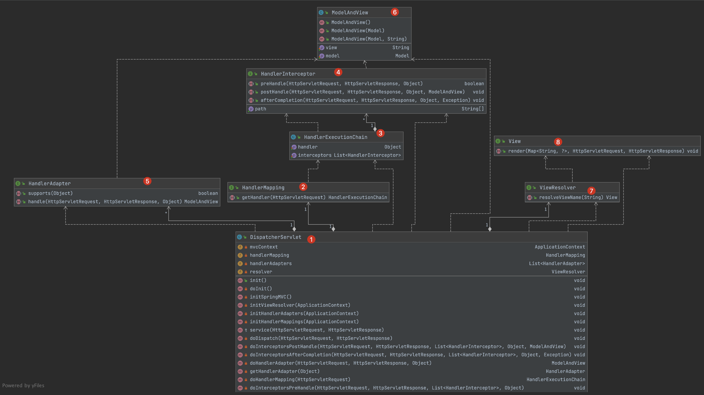
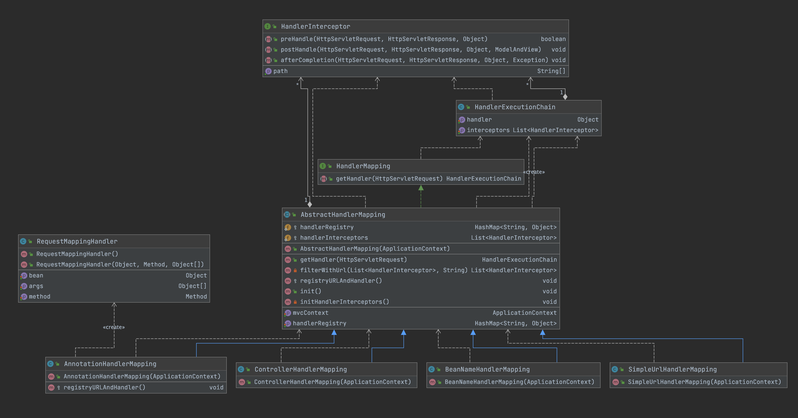
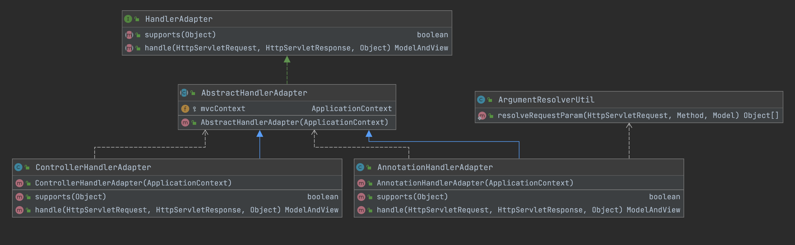
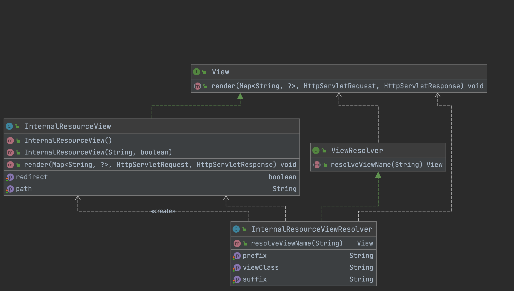

# SpringMVC和核心对象

- ContextLoaderListener：实现ServletContextListener，在web.xml 中声明使用。tomcat容器启动时会反射创建这个对象并调用其生命周期方法。
- DispatcherServlet：实现HttpServlet，注册到web.xml 中拦截特定请求。tomcat容器启动时会反射创建这个对象并调用其生命周期方法。
- HandlerMapping：接口规范。在DispatcherServlet会调用`HandlerMapping.getHandler(req)` 得到HandlerExecutionChain 处理业务。
- HandlerExecutionChain：封装 handler +  List<HandlerInterceptor>。思想：一个handler应该知道它对应的HandlerInterceptor列表。
- HandlerInterceptor：接口规范。可以理解成对handler 的拦截、增强。
- HandlerAdapter：接口规范。`HandlerAdapter. supports(handler)` 找到适配这个handler的**HandlerAdapter**，然后执行`HandlerAdapter.handle(req,resp,handler)` 完成方法的执行
- ViewResolver：接口规范。`ViewResolver.resolveViewName(viewName)` 会返回View接口的实例

- View：接口规范。`view.render(model,req,resp)` 方法里面应该编写对客户端的响应，比如转发、重定向。

# 类图

## SpringMVC

- `HandlerExecutionChain handlerExecutionChain = handlerMapping.getHandler(req)` 调用handlerMapping的实现类的getHandler方法得到 HandlerExecutionChain

- `handlerExecutionChain.getHandlerInterceptors()` 得到HandlerInterceptor列表，遍历执行preHandle() 方法，进行方法调用前的操作

- 遍历找到这个handler 适配的HandlerAdapter 

  ```java
  for (HandlerAdapter adapter : this.handlerAdapters) {
      if (adapter.supports(handler))
          return adapter;
  }
  ```

- 通过`handlerAdapter.handle(req, resp, handler)` 执行真正的业务方法

- 进行POST处理，执行handlerInterceptor.postHandle

- 根据`handlerAdapter.handle` 的返回值判断是否进行视图的解析

  ```java
  if (mv != null) {
    // 视图解析器解析mv，返回view
    View view = resolver.resolveViewName(mv.getView());
    // 页面渲染，渲染其实就是返回信息给客户端
    view.render(mv.getModel(), req, resp);
  }
  ```

- 进行after处理，执行handlerInterceptor.afterCompletion



## HandlerMapping

- HandlerMapping 是接口，该接口依赖HandlerExecutionChain，而HandlerExecutionChain 有依赖HandlerInterceptor



## HandleAdapter

- 定义了执行目标方法的接口方法



## View & ViewResolver

- `viewResolver.resolveViewName()` 返回view
- `view.render()` 响应数据给客户端。所谓的响应数据就是设置这个请求是 转发、重定向、文件上传等等操作。说白了就是往`response.getWriter().write("hello world")`



# 类的详细分析

## HandlerMapping

这是一个接口，定义一个 **将 请求 变成 方法 的映射关系**  的规范。

```java
public interface HandlerMapping {
    HandlerExecutionChain getHandler(HttpServletRequest request) throws Exception;
}
```

## HandlerExecutionChain

HandlerExecutionChain对象是一个方法调用的封装。思想是：一个方法应该知道他对应的拦截器，所以 **一个方法 和 方法拦截器 可以看成一个整体**

方法拦截器(HandlerInterceptor) 可以理解成对方法的增强或者过滤

```java
public class HandlerExecutionChain {
  private RequestMappingHandler handler; // 方法本身，封装了调用方法的必要参数
  private List<HandlerInterceptor> interceptors; // 方法对应的拦截器
}

```

## RequestMappingHandler

RequestMappingHandler 是方法本身。封装了 反射调用方法必备的参数

```java
public class RequestMappingHandler {
    private Object bean; // 调用者
    private Method method; // 调用的方法
    private Object[] args;// 调用参数
    public RequestMappingHandler(Object bean, Method method, Object[] args) {
        this.bean = bean;
        this.method = method;
        this.args = args;
    }
}
```

## HandlerInterceptor

HandlerInterceptor是一个接口。可以理解成对方法的增强或者过滤。因为在使用的时候，是将 HandlerInterceptor 和 method 包装成一个对象(HandlerExecutionChain)，也就是 method 和 HandlerInterceptor是有关系的。然后在真正执行method 时，会先执行HandlerInterceptor 的方法实现增强或者过滤

````java
public interface HandlerInterceptor {
		// 该拦截器应该和那些方法有关系
    String[] getPath();

    // 该方法在请求处理之前调用，返回true表示交给下一个拦截器，返回false表示到此为止
    boolean preHandle(HttpServletRequest request, HttpServletResponse response, Object handler) throws Exception;
		
  	// 视图返回之后，渲染之前被调用
    void postHandle(HttpServletRequest request, HttpServletResponse response, Object handler, ModelAndView modelAndView) throws Exception;
		
    void afterCompletion(HttpServletRequest request, HttpServletResponse response, Object handler, Exception ex) throws Exception;

}

````

## AbstractHandlerMapping

这个是实现了HandlerMapping 的抽象类。定义了通用的方法的实现

```java
public abstract class AbstractHandlerMapping implements HandlerMapping {
    protected ApplicationContext mvcContext;
    protected Map<String, RequestMappingHandler> handlerRegistry;
    List<HandlerInterceptor> handlerInterceptors;

    public AbstractHandlerMapping(ApplicationContext mvcContext) {
        this.mvcContext = mvcContext;
        handlerInterceptors = new ArrayList<>();
        handlerRegistry = new HashMap<>();
      	
      	// 调用模板方法，做初始化操作
        init();
    }

    // 对HandlerMapping接口的实现，封装好 HandlerExecutionChain 然后返回
    @Override
    public HandlerExecutionChain getHandler(HttpServletRequest request) throws Exception {
        HandlerExecutionChain handlerExecutionChain = new HandlerExecutionChain();
        // 设置此次请求 对应的处理方法
        handlerExecutionChain.setHandler(handlerRegistry.get(request.getServletPath()));
        // 获取此次请求匹配的拦截器
        List<HandlerInterceptor> interceptors = filterWithUrl(handlerInterceptors, request.getRequestURI());
        handlerExecutionChain.setInterceptors(interceptors);
        // 返回构建好的HandleExecutionChain
        return handlerExecutionChain;
    }

    // 拦截器的匹配规则很简单，只要requestURI 包含了 handlerInterceptor里面的其中一个path 就算匹配成功
    private List<HandlerInterceptor> filterWithUrl(List<HandlerInterceptor> handlerInterceptors, String requestURI) {
        List<HandlerInterceptor> result = new ArrayList<>();
        // 找到匹配的拦截器
        boolean isMatch = false;
        for (HandlerInterceptor handlerInterceptor : handlerInterceptors) {
            isMatch = false;
            for (String path : handlerInterceptor.getPath()) {
                if (requestURI.contains(path)) {
                    isMatch = true;
                    break;
                }
            }
            // 该请求路径 符合拦截器配置的路径规则
            if (isMatch) {
                result.add(handlerInterceptor);
            }
        }
        return result;
    }
		
    // init 是模板方法，子类可以重写这个方法，来做一些初始化的操作
    protected void init() {

    }
}
```


## AnnotationHandlerMapping

- 这个是HandlerMapping接口的实现。
- AnnotationHandlerMapping想法是 扫描容器中所有bean，找到标注了@RequestMapping 的类，在找到该类对应的标注了@RequestMapping 的方法。这样子就能得到 url 和 具体类的具体方法的关系。`url -> method.invoke(bean,args)`
- AnnotationHandlerMapping 中还会收集容器中所有的HandlerInterceptor 保存起来。`handlerInterceptors = mvcContext.getBeanFactory().getBeansForType(HandlerInterceptor.class);`

```java
public class AnnotationHandleMapping extends AbstractHandlerMapping {

    public AnnotationHandleMapping(ApplicationContext mvcContext) {
        super(mvcContext);
    }

		// init是AbstractHandlerMapping父类 的模板方法，父类在构造器中会调用init方法
    @Override
    protected void init() {
        // 注册map，保存url和handler的对应关系
        registryURLAndHandler();
        // 找到容器中定义的HandlerInterceptor
        initHandlerInterceptors();
    }

    // 收集容器中所有的HandlerInterceptor 的实现，保存到父类handlerInterceptors属性中
    private void initHandlerInterceptors() {
        try {
            handlerInterceptors = mvcContext.getBeanFactory().getBeansForType(HandlerInterceptor.class);
        } catch (Exception e) {
            e.printStackTrace();
        }
    }

    
    // 遍历容器中所有的bean，找到@RequestMapping 标注的类和方法，注册到HandleRegistry中。
    private void registryURLAndHandler() {
        // 找到容器中所有标注了 @RequestMapping 的类
        for (Map.Entry<String, BeanDefinition> entry : mvcContext.getBeanFactory().getBeanDefinitionMap().entrySet()) {
            Class clazz = entry.getValue().getBeanClass();
            Object bean = entry.getValue().getBean();

            Annotation annotation = clazz.getAnnotation(RequestMapping.class);
            if (annotation == null) {
                continue;
            }
            String prefix = null;
            String suffix = null;
            prefix = ((RequestMapping) annotation).value();

            // 获取方法的映射路径
            for (Method declaredMethod : clazz.getDeclaredMethods()) {
                annotation = declaredMethod.getAnnotation(RequestMapping.class);
                if (annotation == null) {
                    continue;
                }
                suffix = ((RequestMapping) annotation).value();

                // 构建RequestMappingHandle 然后注册到handlerRegistry 中
                handlerRegistry.put(prefix + suffix, new RequestMappingHandler(bean, declaredMethod, null));
            }

        }
    }

}

```

## DispatcherServlet

这是HttpServlet的实现。也是SpringMVC 的核心代码。通过这里的代码逻辑，才能理解为什么有HandleExecutionChain

- 重写init方法，在里面创建一个AnnotationHandlerMapping来作为HandlerMapping 的默认实现
- http请求匹配到DispatcherServlet 时，service -> doDispatch。doDispatch 中会执行`handlerMapping.getHandler(req)` 拿到这次请求的 HandlerExecutionChain。然后先执行HandlerExecutionChain 里面的HandlerInterceptor 在执行目标 handler方法。

```java
package cn.haitaoss.tinyspringmvc.framework.servlet;

import cn.haitaoss.tinyioc.context.ApplicationContext;
import cn.haitaoss.tinyioc.context.ClassPathXmlApplicationContext;
import cn.haitaoss.tinyspringmvc.framework.handlerMapping.*;

import javax.servlet.ServletContext;
import javax.servlet.ServletException;
import javax.servlet.http.HttpServlet;
import javax.servlet.http.HttpServletRequest;
import javax.servlet.http.HttpServletResponse;
import java.util.List;

/**
 * @author haitao.chen
 * email haitaoss@aliyun.com
 * date 2021-04-24 17:09
 *
 */
public class DispatcherServlet extends HttpServlet {
    private ApplicationContext mvcContext;
    private HandlerMapping handlerMapping;

    @Override
    public void init() throws ServletException {
        doInit();
        // 默认使用AnnotationHandlerMapping来处理请求
        handlerMapping = new AnnotationHandlerMapping(mvcContext);
    }

    private void doInit() throws ServletException {
        System.out.println("DispatcherServlet...init\tspring子容器(mvc)");
        // 获取mvc配置文件
        String mvcXmlPath = this.getInitParameter("contextConfigLocation");
        if (mvcXmlPath == null || mvcXmlPath.length() == 0) {
            return;
        }
        if (mvcXmlPath.startsWith("classpath:")) {
            mvcXmlPath = mvcXmlPath.substring(10);
        }
        // 获取全局上下文
        ServletContext servletContext = this.getServletContext();
        try {
            // 获取父容器
            ApplicationContext springContext = (ApplicationContext) servletContext.getAttribute("springContext");
            // 创建mvc的容器，里面整合和spring作为父容器
            mvcContext = new ClassPathXmlApplicationContext(springContext, mvcXmlPath);
        } catch (Exception e) {
            e.printStackTrace();
        }
    }

    // http请求路径 匹配当前servlet配置在web.xml 中的规则时，会调用这个方法处理业务
    @Override
    protected void service(HttpServletRequest req, HttpServletResponse resp) {
        try {
            doDispatch(req, resp);
        } catch (Exception e) {
            e.printStackTrace();
        }
    }

    private void doDispatch(HttpServletRequest req, HttpServletResponse resp) throws Exception {
        // 找到请求对应的 HandlerExecutionChain
        HandlerExecutionChain handlerExecutionChain = handlerMapping.getHandler(req);
        RequestMappingHandler handler = handlerExecutionChain.getHandler();
        List<HandlerInterceptor> handlerInterceptors = handlerExecutionChain.getInterceptors();

        // 拦截器执行特点： 先执行全部的preHandler方法。只要执行的preHandler方法没有返回false 那么对应的afterCompletion一定会执行。
        for (int i = 0; i < handlerInterceptors.size(); i++) {
            HandlerInterceptor handlerInterceptor = handlerInterceptors.get(i);
            if (!handlerInterceptor.preHandle(req, resp, handler)) {
                for (int j = i - 1; j >= 0; j--) {
                    handlerInterceptors.get(j).afterCompletion(req, resp, handler, new Exception());
                }
                break;
            }
        }
        // 只要某一个HandlerInterceptor 的 preHandler 返回了false，那么不应该调用目标方法（这里还没有实现这个功能）
        // 至于如何传参，就是HandlerAdapter的事情了
        handler.getMethod().invoke(handler.getBean(), null);
    }
}

```


## AnnotationHandlerAdapter

HandlerAdapter的实现类

```java
public class AnnotationHandlerAdapter extends AbstractHandlerAdapter {
  public AnnotationHandlerAdapter(ApplicationContext mvcContext) {
    super(mvcContext);
  }

  @Override
  public boolean supports(Object handler) {
    return handler instanceof RequestMappingHandler;
  }

  @Override
  public ModelAndView handle(HttpServletRequest request, HttpServletResponse response, Object handler) throws Exception {
    RequestMappingHandler rmHandler = (RequestMappingHandler) handler;
    Model model = new Model();
    // 获取方法的执行参数的值
    Object[] args = ArgumentResolverUtil.resolveRequestParam(request, rmHandler.getMethod(), model);
    // 执行方法
    Object obj = rmHandler.getMethod().invoke(rmHandler.getBean(), args);

    // return null 就不会进行视图解析
    Annotation annotation = rmHandler.getMethod().getAnnotation(ResponseBody.class);
    if (annotation != null) {
      // 设置json响应头
      response.setCharacterEncoding("UTF-8");
      response.setContentType("application/json; charset=utf-8");
      response.getWriter().write(JSONObject.toJSONString(obj));
      response.getWriter().close();
      return null;
    }
    if (obj == null)
      return null;
    if (obj instanceof ModelAndView) {
      return (ModelAndView) obj;
    }
    ModelAndView mv = new ModelAndView();
    if (obj instanceof String) {
      mv.setModel(model);
      mv.setView((String) obj);
    }
    return mv;

  }
}
```

## View、ViewResolver

# SpringMVC的初始化

web项目的核心配置文件：web.xml

```xml
<?xml version="1.0" encoding="UTF-8"?>
<web-app xmlns="http://xmlns.jcp.org/xml/ns/javaee"
         xmlns:xsi="http://www.w3.org/2001/XMLSchema-instance"
         xsi:schemaLocation="http://xmlns.jcp.org/xml/ns/javaee http://xmlns.jcp.org/xml/ns/javaee/web-app_4_0.xsd"
         version="4.0">
  <!-- 注册监听器，web项目启动就会创建监听器，调用监听器的模板方法 -->
  <listener>
    <listener-class>cn.haitaoss.tinyspringmvc.framework.contextListener.ContextLoaderListener</listener-class>
  </listener>
  <!-- 设置上下文参数 -->
  <context-param>
    <param-name>contextConfigLocation</param-name>
    <param-value>classpath:applicationContext.xml</param-value>
  </context-param>
  <!-- 注册servlet -->
  <servlet>
    <servlet-name>dispatcherServlet</servlet-name>
    <servlet-class>cn.haitaoss.tinyspringmvc.framework.servlet.DispatcherServlet</servlet-class>
    <!-- 设置这个servlet 的初始化参数 -->
    <init-param>
      <param-name>contextConfigLocation</param-name>
      <param-value>classpath:applicationContext-mvc.xml</param-value>
    </init-param>
    <!-- web项目一启动就创建这个servlet -->
    <load-on-startup>1</load-on-startup>
  </servlet>
  <!-- 配置servlet的过滤规则 -->
  <servlet-mapping>
    <servlet-name>dispatcherServlet</servlet-name>
    <url-pattern>*.do</url-pattern>
  </servlet-mapping>
</web-app>
```

- web项目启动读取web.xml 文件，加载listener 标签的配置。反射创建出ContextLoaderListener，然后执行其生命周期方法，实现**spring容器的创建**，然后我们配置的DispatcherServlet 配置load-on-startup了属性，那么这个servlet也会在web项目启动的时候反射创建，调用其生命周期方法。

- DispatcherServlet 的初始化方法。

  ```java
  public class DispatcherServlet extends HttpServlet {
      private ApplicationContext mvcContext;
      private HandlerMapping handlerMapping;
      private List<HandlerAdapter> handlerAdapters = null;
      private ViewResolver resolver = null;
  
      @Override
      public void init() {
         	// 初始化mvc容器
          initSpringMVC();
          // 初始化HandlerMapping
          initHandlerMappings(mvcContext);
          // 初始化handlerAdapter
          initHandlerAdapters(mvcContext);
          // 初始化ViewResolver
          initViewResolver(mvcContext);
      }
  }
  ```

- initSpringMVC() ：读取servlet的初始化参数，并且以spring容器作为父容器 创建出mvc容器，保存到 mvcContext属性中

- initHandlerMappings(mvcContext)：创建HandlerMapping，并执行器初始化方法。

  ```java
  private void initHandlerMappings(ApplicationContext mvcContext) {
    // 默认的handlerMapping 是 AnnotationHandlerMapping
    handlerMapping = new AnnotationHandlerMapping(mvcContext);
    ((AnnotationHandlerMapping) handlerMapping).init();
    new ControllerHandlerMapping(mvcContext).init();
    new SimpleUrlHandlerMapping(mvcContext).init();
    new BeanNameHandlerMapping(mvcContext).init();
  }
  ```

  - 举例：AnnotationHandlerMapping.init()

  ```java
  public void init() {
    // AnnotationHandlerMapping.registryURLAndHandler的实现是 遍历容器中所有的bean，找到@RequestMapping 标注的类和方法，注册到HandleRegistry中。
    registryURLAndHandler();// 注册map，保存url和handler的对应关系
    initHandlerInterceptors(); // 收集容器中所有的HandlerInterceptor
  }
  ```

- initHandlerAdapters(mvcContext)：保存所有的handlerAdapter到handlerAdapters 属性中

- initViewResolver(mvcContext)：找到容器中创建的ViewResolver 的实现，保存到resolver属性中

# SpringMVC拦截、处理请求的流程

因为我们的DispatcherServlet 配置在web.xml 中，但我们发出的请求满足配置规则，就会将请求调用到 `DispatcherServlet.service(req,resp)`

```java
@Override
protected void service(HttpServletRequest req, HttpServletResponse resp) {
  try {
    // 调用doDispatch 处理请求
    doDispatch(req, resp);
  } catch (Exception e) {
    e.printStackTrace();
  }
}
```

```java
private void doDispatch(HttpServletRequest req, HttpServletResponse resp) throws Exception {
  // 找到请求对应的handlerMapping
  HandlerExecutionChain handlerExecutionChain = doHandlerMapping(req);
  Object handler = handlerExecutionChain.getHandler();
  List<HandlerInterceptor> handlerInterceptors = handlerExecutionChain.getInterceptors();

  // 进行前置处理，执行handlerInterceptor.preHandle
  doInterceptorsPreHandle(req, resp, handlerInterceptors, handler);

  // 进入HandlerAdapter模块(里面会执行req 对应的 method)
  // modelAndView 是执行方法的返回结果
  ModelAndView mv = doHandlerAdapter(req, resp, handler);

  // 进行POST处理，执行handlerInterceptor.postHandle
  doInterceptorsPostHandle(req, resp, handlerInterceptors, handler, mv);

  if (mv != null) {
    // 视图解析器解析mv，返回view
    View view = resolver.resolveViewName(mv.getView());
    // 页面渲染，渲染其实就是返回信息给客户端
    view.render(mv.getModel(), req, resp);
  }
	
  // 进行后置处理
  doInterceptorsAfterCompletion(req, resp, handlerInterceptors, handler, new Exception());
}
```

- 通过`HandlerMapping.getHandler(req)` 得到该请求对应的HandlerExecutionChain

  ```java
  HandlerExecutionChain handlerExecutionChain = new HandlerExecutionChain();
  // 设置此次请求 对应的处理方法
  handlerExecutionChain.setHandler(handlerRegistry.get(request.getServletPath()));
  // 获取此次请求匹配的拦截器
  List<HandlerInterceptor> interceptors = filterWithUrl(handlerInterceptors, request.getServletPath());
  handlerExecutionChain.setInterceptors(interceptors);
  // 返回构建好的HandleExecutionChain
  return handlerExecutionChain;
  ```

- 进行前置处理，执行handlerInterceptor.preHandle

- 找到合适的HandlerAdapter，然后执行目标方法

- 进行POST处理，执行handlerInterceptor.postHandle

- 判断 handler返回结果是否为null

  - 不为null。

    `		// 视图解析器解析mv，返回view
        View view = resolver.resolveViewName(mv.getView());
        // 页面渲染，渲染其实就是返回信息给客户端
        view.render(mv.getModel(), req, resp);`

  - 为null的可能性：比如想返回json数据给客户端

    ```java
    Annotation annotation = rmHandler.getMethod().getAnnotation(ResponseBody.class);
    if (annotation != null) {
      // 设置json响应头
      response.setCharacterEncoding("UTF-8");
      response.setContentType("application/json; charset=utf-8");
      response.getWriter().write(JSONObject.toJSONString(obj));
      response.getWriter().close();
      // return null 就不会进行视图解析
      return null;
    }
    ```

    

- 进行后置处理


