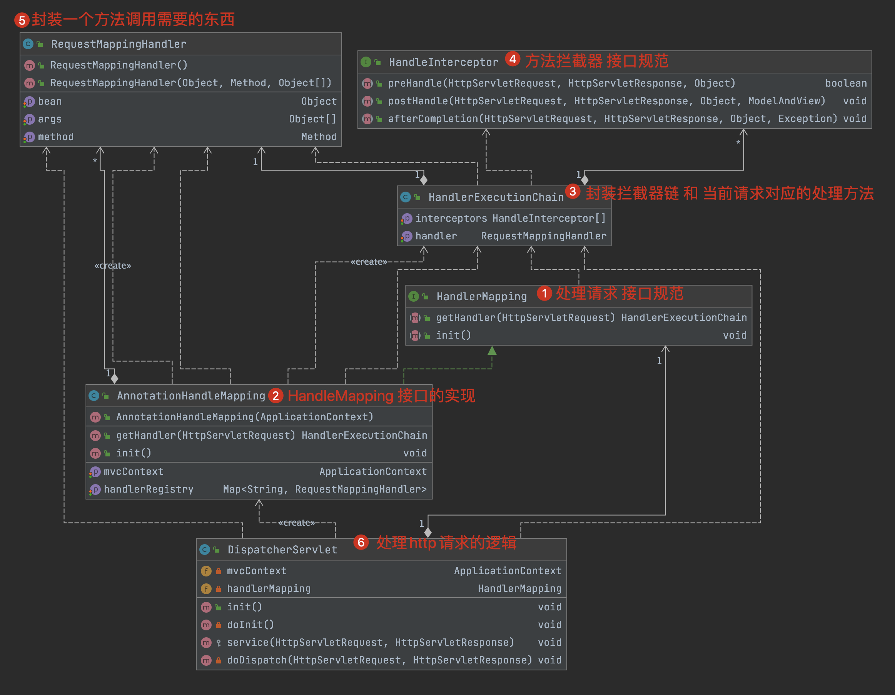
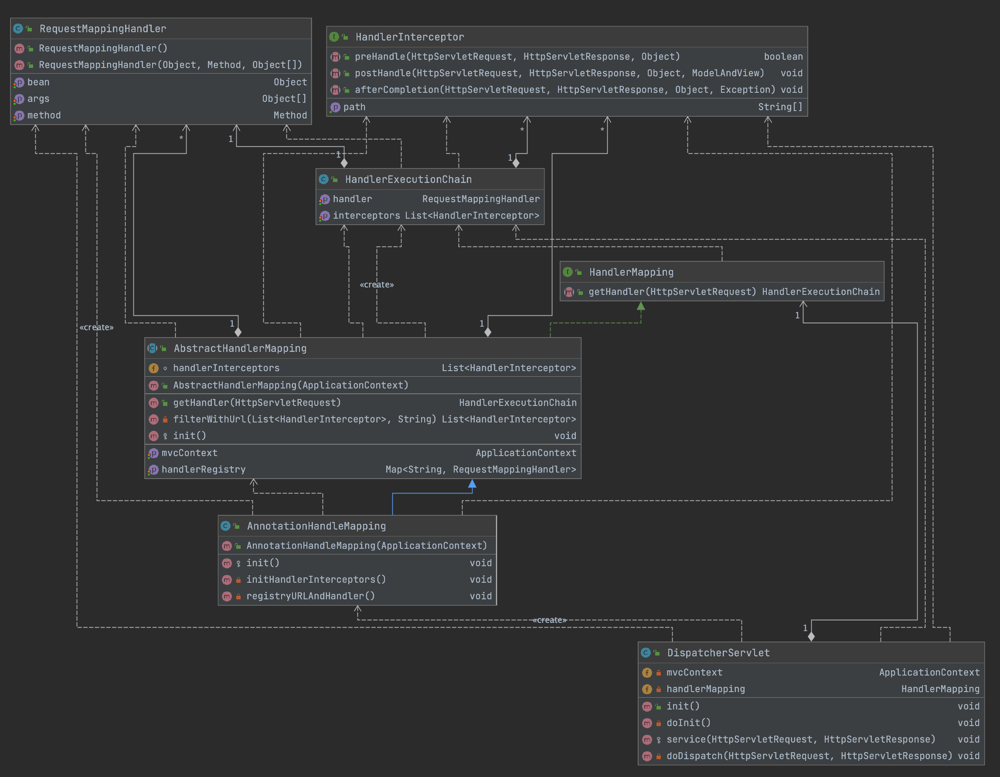

# step-1.1-solve-SpringInit 
> 实现spring和web项目的整合
- tomcat项目启动时会读取web.xml 文件。
- 我们在web.xml 中配置了listener，那么tomcat 就会通过反射创建这个listener，然后调用里面的模板方法
- 我们在模板方法里面编写了创建IOC容器的代码，所以就实现了web项目和spring 的整合

# step-1.2-solve-SpringMVCInit

> 实现springmvc的初始化

- 编写一个servlet，重写init 方法，将这个servlet 配置在web.xml 中。
- 那么web项目启动的时候，就会读取web.xml 然后创建出这个servlet并调用初始化方法 进行servlet的初始化。
- init的重要逻辑：我们先从ServletContext获取通过ServletContextListener 的初始化方法注入的父容器。然后再根据 **mvc配置文件 + 父容器** 创建出来的容器就是 MVC容器。

# step-2.1-solve-requestMapping

> 实现http请求 --> controller中具体方法的映射

## 主要的几个类



- RequestMappingHandler：封装了要执行的方法method，执行方法的对象bean以及参数args
- HandlerExecutionChain：其中封装了1个RequestMappingHandler实例和1个拦截器列表
- HandlerMapping：定义了接口规范
- AnnotationHandlerMapping：实现了HandlerMapping接口，里面有一个重要属性`Map<String,RequestMappingHandler> handlerRegistry` 这里保存 每个url 对应的处理对象是什么

## 一次请求的流程 (注意：并没有加入拦截器的流程)

 -  http请求 -> DispatcherServlet.service() -> 调用doDispatch(req, resp);

    -> 根据请求找到对应的HandleExecutionChain

     `HandlerExecutionChain handlerExecutionChain = handlerMapping.getHandler(req);`  ->

    -> 执行handlerExecutionChain中的目标方法 

    `RequestMappingHandler handler = handlerExecutionChain.getHandler();`

    `handler.getMethod().invoke(handler.getBean(), null);`

## AnnotationHandlerMapping注册 url 和 RequestMappingHandler的核心代码

1. DispatcherServlet 的初始化方法

   ```java
   public class DispatcherServlet extends HttpServlet {
       private ApplicationContext mvcContext;
       private HandlerMapping handlerMapping;
   
       @Override
       public void init() throws ServletException {
           // 1. 从ServletContext 中获取 spring容器。这个会作用mvcContext容器的父容器
           // 2. 读取配置在web.xml 中 servlet 的init-param 创建出mvcContext
           doInit();
           // 默认使用AnnotationHandlerMapping来处理请求
           handlerMapping = new AnnotationHandleMapping(mvcContext);
       }
   }
   ```

2. AnnotationHandlerMapping的构造器做了什么

   ```java
   public class AnnotationHandleMapping implements HandlerMapping {
       private ApplicationContext mvcContext;
       private Map<String, RequestMappingHandler> handlerRegistry;
   
       public AnnotationHandleMapping(ApplicationContext mvcContext) {
           this.mvcContext = mvcContext;
           this.handlerRegistry = new HashMap<>();
           
           // 会遍历mvcContext 里面所有的bean，找到使用了@RequestMapping注解的类
         	// 将@RequestMapping注解的值 和 对应的处理method 组成键值对，保存到handlerRegistry 中
           init();
       }
   }
   ```

3. init方法做了什么

   - 遍历容器中所有的bean，找到@RequestMapping 标注的类和方法，注册到HandleRegistry中。
   - 注意：这里写的比较简单，只有类也标注了@RequestMapping 注解我们才能扫描到
   - 

   ```java
   public void init() {
     // 找到容器中所有标注了 @RequestMapping 的类
     for (Map.Entry<String, BeanDefinition> entry : this.mvcContext.getBeanFactory().getBeanDefinitionMap().entrySet()) {
       Class clazz = entry.getValue().getBeanClass();
       Object bean = entry.getValue().getBean();
   
       Annotation annotation = clazz.getAnnotation(RequestMapping.class);
       if (annotation == null) {
         continue;
       }
       String prefix = null;
       String suffix = null;
       prefix = ((RequestMapping) annotation).value();
   
       // 获取方法的映射路径
       for (Method declaredMethod : clazz.getDeclaredMethods()) {
         annotation = declaredMethod.getAnnotation(RequestMapping.class);
         if (annotation == null) {
           continue;
         }
         suffix = ((RequestMapping) annotation).value();
   
         // 构建RequestMappingHandle 然后注册到handlerRegistry 中
         this.handlerRegistry.put(prefix + suffix, new RequestMappingHandler(bean, declaredMethod, null));
       }
   
     }
   }
   ```

4. getHandler方法

   - 根据`request.getServletPath()`  从 handlerRegistry 中得到对应的处理函数 RequestMappingHandler
   - 根据RequestMappingHandler 和 HandleInterceptor 构建 HandlerExecutionChain 返回

   ```java
   public HandlerExecutionChain getHandler(HttpServletRequest request) throws Exception {
     HandlerExecutionChain handlerExecutionChain = new HandlerExecutionChain();
     // 根据请求uri 找到对应的handle
     RequestMappingHandler requestMappingHandler = handlerRegistry.get(request.getServletPath());
     handlerExecutionChain.setHandler(requestMappingHandler);
     return handlerExecutionChain;
   }
   ```

## DispatcherServlet 处理http请求的逻辑

1. init方法

   - 调用doInit方法

   - 对handlerMapping 属性进行初始化

   ```java
   public class DispatcherServlet extends HttpServlet {
       private ApplicationContext mvcContext;
       private HandlerMapping handlerMapping;
   
       @Override
       public void init() throws ServletException {
           doInit();
           // 默认使用AnnotationHandlerMapping来处理请求
           handlerMapping = new AnnotationHandleMapping(mvcContext);
       }
   }
   ```

2. doInit方法

   - 从ServletContext 中获取 spring容器。这个会作为mvcContext容器的父容器
   - 读取配置在web.xml 中 servlet 的init-param 创建出mvcContext

   ```java
   private void doInit() throws ServletException {
           super.init();
           System.out.println("DispatcherServlet...init\tspring子容器(mvc)");
           // 获取mvc配置文件
           String mvcXmlPath = this.getInitParameter("contextConfigLocation");
           if (mvcXmlPath == null || mvcXmlPath.length() == 0) {
               return;
           }
           if (mvcXmlPath.startsWith("classpath:")) {
               mvcXmlPath = mvcXmlPath.substring(10);
           }
           // 获取全局上下文
           ServletContext servletContext = this.getServletContext();
           try {
               // 获取父容器
               ApplicationContext springContext = (ApplicationContext) servletContext.getAttribute("springContext");
               // 创建mvc的容器，里面整合和spring作为父容器
               mvcContext = new ClassPathXmlApplicationContext(springContext, mvcXmlPath);
           } catch (Exception e) {
               e.printStackTrace();
           }
       }
   ```

3. tomcat处理http请求的逻辑：根据 url-pattern 调用对应 servlet 的 service方法

   ```xml
   <!-- 注册servlet -->
   <servlet>
     <servlet-name>dispatcherServlet</servlet-name>
     <servlet-class>cn.haitaoss.tinyspringmvc.framework.servlet.DispatcherServlet</servlet-class>
     <!-- 设置这个servlet 的初始化参数 -->
     <init-param>
       <param-name>contextConfigLocation</param-name>
       <param-value>classpath:applicationContext-mvc.xml</param-value>
     </init-param>
     <!-- web项目一启动就创建这个servlet -->
     <load-on-startup>1</load-on-startup>
   </servlet>
   <!-- 配置servlet的过滤规则 -->
   <servlet-mapping>
     <servlet-name>dispatcherServlet</servlet-name>
     <url-pattern>*.do</url-pattern>
   </servlet-mapping>
   ```

4. service 方法

   ```java
    protected void service(HttpServletRequest req, HttpServletResponse resp) {
           try {
               doDispatch(req, resp);
           } catch (Exception e) {
               e.printStackTrace();
           }
       }
   ```

   - 通过handlerMapping.getHandler(req); 得到 HandleExecutionChain
   - 调用HandleExecutionChain 里面封装好的目标方法执行业务

   ```java
   private void doDispatch(HttpServletRequest req, HttpServletResponse resp) throws Exception {
           // 找到请求对应的handler
           HandlerExecutionChain handlerExecutionChain = handlerMapping.getHandler(req);
   
           // 执行目标方法
           RequestMappingHandler handler = handlerExecutionChain.getHandler();
           // 至于如何传参，就是HandlerAdapter的事情了
           handler.getMethod().invoke(handler.getBean(), null);
       }
   ```

# step-2.2-solve-interceptor

> 实现拦截器 和 修改类结构



## AbstractHandlerMapping

- 实现HandlerMapping接口，并且定义了一个模板方法init()。子类有一些初始化操作可以重写init方法

````java
public abstract class AbstractHandlerMapping implements HandlerMapping {
    protected ApplicationContext mvcContext;
    protected Map<String, RequestMappingHandler> handlerRegistry;
    List<HandlerInterceptor> handlerInterceptors;

    public AbstractHandlerMapping(ApplicationContext mvcContext) {
        this.mvcContext = mvcContext;
        handlerInterceptors = new ArrayList<>();
        handlerRegistry = new HashMap<>();
        init(); // 模板方法
    }
  	protected void init() {

    }
}
````

- getHandler方法：每次调用都会通过url 获取这次请求对应的目标方法，还有收集匹配到的HandlerInterceptro，然后包装成HandlerExecutionChain 返回

  ```java
  @Override
  public HandlerExecutionChain getHandler(HttpServletRequest request) throws Exception {
    HandlerExecutionChain handlerExecutionChain = new HandlerExecutionChain();
    // 设置此次请求 对应的处理方法
    handlerExecutionChain.setHandler(handlerRegistry.get(request.getServletPath()));
    // 获取此次请求匹配的拦截器
    List<HandlerInterceptor> interceptors = filterWithUrl(handlerInterceptors, request.getRequestURI());
    handlerExecutionChain.setInterceptors(interceptors);
    // 返回构建好的HandleExecutionChain
    return handlerExecutionChain;
  }
  ```

- filterWithUrl方法：这里只做了简单的实现，只要HandleInterceptor 的path符合url的一部分，就算是这次请求的拦截器

  ```java
  private List<HandlerInterceptor> filterWithUrl(List<HandlerInterceptor> handlerInterceptors, String requestURI) {
    List<HandlerInterceptor> result = new ArrayList<>();
    // 找到匹配的拦截器
    boolean isMatch = false;
    for (HandlerInterceptor handlerInterceptor : handlerInterceptors) {
      isMatch = false;
      for (String path : handlerInterceptor.getPath()) {
        if (requestURI.contains(path)) {
          isMatch = true;
          break;
        }
      }
      // 该请求路径 符合拦截器配置的路径规则
      if (isMatch) {
        result.add(handlerInterceptor);
      }
    }
    return result;
  }
  ```

## AnnotationHandlerMapping

```java
public class AnnotationHandleMapping extends AbstractHandlerMapping {

    public AnnotationHandleMapping(ApplicationContext mvcContext) {
    		// 调用父类构造器实现初始化
        // 而父类构造器里面会调用模板方法init，我们重写了init，所以会调用下面的init方法初始化
        super(mvcContext);
    }

    // 重写模板方法init，父类构造器初始化时回调这个方法
    @Override
    protected void init() {
        // 注册map，保存url和handler的对应关系。这些键值对保存在父类的 handlerRegistry属性中
        registryURLAndHandler();
        // 找到容器中定义的HandlerInterceptor的实现，赋值给父类的 handlerInterceptors 属性
        initHandlerInterceptors();
    }
}
```

## DispatcherServlet

拦截器代码的实现

```java
protected void service(HttpServletRequest req, HttpServletResponse resp) {
  try {
    doDispatch(req, resp);
  } catch (Exception e) {
    e.printStackTrace();
  }
}

private void doDispatch(HttpServletRequest req, HttpServletResponse resp) throws Exception {
  // 找到请求对应的handler
  HandlerExecutionChain handlerExecutionChain = handlerMapping.getHandler(req);
  RequestMappingHandler handler = handlerExecutionChain.getHandler();
  List<HandlerInterceptor> handlerInterceptors = handlerExecutionChain.getInterceptors();

  // 拦截器执行特点： 先执行全部的preHandler方法。只要执行的preHandler方法没有返回false 那么对应的afterCompletion一定会执行。
  for (int i = 0; i < handlerInterceptors.size(); i++) {
    HandlerInterceptor handlerInterceptor = handlerInterceptors.get(i);
    if (!handlerInterceptor.preHandle(req, resp, handler)) {
      for (int j = i - 1; j >= 0; j--) {
        handlerInterceptors.get(j).afterCompletion(req, resp, handler, new Exception());
      }
      break;
    }
  }
  // 只要某一个HandlerInterceptor 的 preHandler 返回了false，那么不应该调用目标方法（这里还没有实现这个功能）
  // 至于如何传参，就是HandlerAdapter的事情了
  handler.getMethod().invoke(handler.getBean(), null);
}
```

# step-3.0-solve-step2Problems

> 解决第二步里面的问题

- handlerRegistry 泛型应该是Object

```java
public abstract class AbstractHandlerMapping implements HandlerMapping {
    protected static HashMap<String, Object> handlerRegistry = new HashMap<>();
    protected static List<HandlerInterceptor> handlerInterceptors = new ArrayList<>();
    protected ApplicationContext mvcContext;
}
```

- HandlerExecutionChain 中的handler应该是Object 类型而不是RequestMappingHandler

```java
public class HandlerExecutionChain {
    private Object handler;
    private List<HandlerInterceptor> interceptors;

    public Object getHandler() {
        return handler;
    }

    public void setHandler(Object handler) {
        this.handler = handler;
    }

    public List<HandlerInterceptor> getInterceptors() {
        return interceptors;
    }

    public void setInterceptors(List<HandlerInterceptor> interceptors) {
        this.interceptors = interceptors;
    }
}
```

- 调用的时候需要判断handler 的类型在调用

```java
private void doDispatch(HttpServletRequest req, HttpServletResponse resp) throws Exception {
  // 找到请求对应的handler
  HandlerExecutionChain handlerExecutionChain = handlerMapping.getHandler(req);
  Object handler = handlerExecutionChain.getHandler();
  List<HandlerInterceptor> handlerInterceptors = handlerExecutionChain.getInterceptors();

  // 拦截器执行特点： 先执行全部的preHandler方法。只要执行的preHandler方法没有返回false 那么对应的afterCompletion一定会执行。
  for (int i = 0; i < handlerInterceptors.size(); i++) {
    HandlerInterceptor handlerInterceptor = handlerInterceptors.get(i);
    if (!handlerInterceptor.preHandle(req, resp, handler)) {
      for (int j = i - 1; j >= 0; j--) {
        handlerInterceptors.get(j).afterCompletion(req, resp, handler, new Exception());
      }
      break;
    }
  }
  // 只要某一个HandlerInterceptor 的 preHandler 返回了false，那么不应该调用目标方法（这里还没有实现这个功能）
  // 至于如何传参，就是HandlerAdapter的事情了
  if (handler instanceof RequestMappingHandler) {
    ((RequestMappingHandler) handler).getMethod().invoke(((RequestMappingHandler) handler).getBean(), null);
  }
}
```

# step-3.1-solveHandlerAdapter

> 实现HandlerAdapter

## HandlerAdapter

HandlerAdapter 是一个接口，定义规范。

```java
public interface HandlerAdapter {
  boolean supports(Object handler);
  ModelAndView handle(HttpServletRequest request, HttpServletResponse response, Object handler) throws Exception;
}
```

## AbstractHandlerAdapter

AbstractHandlerAdapter 是 HandlerAdapter接口的实现，编写通用的东西(主要是属性)

```java
public abstract class AbstractHandlerAdapter implements HandlerAdapter {
    protected ApplicationContext mvcContext;

    public AbstractHandlerAdapter(ApplicationContext mvcContext) {
        this.mvcContext = mvcContext;
    }
}
```

## AnnotationHandlerAdapter

AnnotationHandlerAdapter 只处理RequestMappingHandler

```java
public class AnnotationHandlerAdapter extends AbstractHandlerAdapter {
    public AnnotationHandlerAdapter(ApplicationContext mvcContext) {
        super(mvcContext);
    }

    @Override
    public boolean supports(Object handler) {
        if (handler instanceof RequestMappingHandler) {
            return true;
        }
        return false;
    }

    @Override
    public ModelAndView handle(HttpServletRequest request, HttpServletResponse response, Object handler) throws Exception {
        RequestMappingHandler rmHandler = (RequestMappingHandler) handler;
        // 获取方法的执行参数的值
        Object[] args = ArgumentResolverUtil.resolveRequestParam(request, rmHandler.getMethod());
        // 执行方法
        Object obj = rmHandler.getMethod().invoke(rmHandler.getBean(), args);
        return new ModelAndView(obj);
    }
}
```

收集方法执行参数的思想：

`http://localhost:8080/eat.do?name=haitao&girlfriends=ll&girlfriend=hh`

- 通过HttpServletRequest.getParameterMap() 得到查询参数的map
- 得到方法的参数类别。`Parameter[] parameters = method.getParameters();`
- 遍历parameters，通过`parameter.getName() `从map中获取value，
  - 如果 `value!=null`。判断`parameter.getType == String.class`
    - 如果是true，参数的值就是value
    - 如果是false，参数的值需要通过spring容器中的converter解析。`ConverterFactory.getConverterMap().get(parameter.getType()).parse(value)`
  - 如果`value==null`
    - 获取参数的类型，通过反射创建实例。`(Class(parameter.getType())).newInstance()`
    - 然后在使用Beanutils 将map里面的属性值拷贝到 新创建的实例中

```java
public class ArgumentResolverUtil {
    public static Object[] resolveRequestParam(HttpServletRequest request, Method method) throws Exception {
        // 获取方法的参数值
        Parameter[] parameters = method.getParameters();
        Object[] args = new Object[parameters.length];
        if (parameters.length == 0) {
            return args;
        }

        // 获取查询参数
        Map<String, String[]> paramMap = request.getParameterMap();
        Map<String, String> argMap = new LinkedHashMap<>();
        for (Map.Entry<String, String[]> entry : paramMap.entrySet()) {
            String paramName = entry.getKey();
            String paramValue = "";
            String[] paramValueArr = entry.getValue();
            for (int i = 0; i < paramValueArr.length; i++) {
                if (i == paramValueArr.length - 1)
                    paramValue += paramValueArr[i];
                else
                    paramValue += paramValueArr[i] + ",";
            }
            // 处理后的request键值对
            argMap.put(paramName, paramValue);
        }

        for (int i = 0; i < parameters.length; i++) {
            Parameter parameter = parameters[i];
            if (argMap.containsKey(parameter.getName())) {
                String value = argMap.get(parameter.getName());
                Type type = parameter.getType();
                // 字符串类型，直接赋值
                if (type == String.class)
                    args[i] = value;
                else
                    // 复杂参数类型 通过converter解析在赋值
                    args[i] = ConverterFactory.getConverterMap().get(parameter.getType()).parse(value);
            } else {
                // 没有的参数，就通过反射创建实例
                Type type = parameter.getType();
                Object bean = ((Class) type).newInstance();
                try {
                    // 将map里面的属性 拷贝到新创建的实例中
                    BeanUtils.populate(bean, argMap);
                    args[i] = ((Class) type).cast(bean);
                } catch (Exception e) {
                    args[i] = null;
                }
            }
        }
        return args;
    }
}
```

## DispatcherServlet

核心的方法

```java

private void doDispatch(HttpServletRequest req, HttpServletResponse resp) throws Exception {
  // 找到请求对应的handlerMapping
  HandlerExecutionChain handlerExecutionChain = doHandlerMapping(req);
  Object handler = handlerExecutionChain.getHandler();
  List<HandlerInterceptor> handlerInterceptors = handlerExecutionChain.getInterceptors();

  // 进行前置处理，执行handlerInterceptor.preHandle
  doInterceptorsPreHandle(req, resp, handlerInterceptors, handler);

  // 进入HandlerAdapter模块(里面会执行req 对应的 method)
  // modelAndView 是执行方法的返回结果
  ModelAndView modelAndView = doHandlerAdapter(req, resp, handler);

  // 进行POST处理，执行handlerInterceptor.postHandle
  doInterceptorsPostHandle(req, resp, handlerInterceptors, handler, modelAndView);

}
```

```java
private ModelAndView doHandlerAdapter(HttpServletRequest req, HttpServletResponse resp, Object handler) throws Exception {
  // 获取适配的 handlerAdapter
  HandlerAdapter handlerAdapter = getHandlerAdapter(handler);
  ModelAndView mv = handlerAdapter.handle(req, resp, handler);
  return mv;
}
```

```java
public ModelAndView handle(HttpServletRequest request, HttpServletResponse response, Object handler) throws Exception {
  RequestMappingHandler rmHandler = (RequestMappingHandler) handler;
  // 获取方法的执行参数的值
  Object[] args = ArgumentResolverUtil.resolveRequestParam(request, rmHandler.getMethod());
  // 执行方法
  Object obj = rmHandler.getMethod().invoke(rmHandler.getBean(), args);
  return new ModelAndView(obj);
}
```

